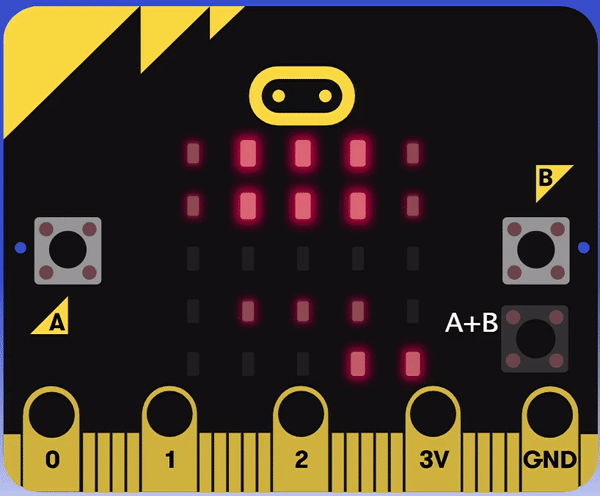
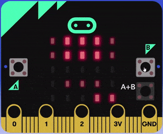

> [!WARNING]  
> THIS PROJECT ONLY WORKS ON MICRO:BIT V2 DEVICES.
  almost 500 line of code is too much apparently...

# "Simple" 2D platformer / side scroller

this is a fully functional arcade style game where you 
go from door to door completing levels in a dungeon you 
inhabit, which can be played right now [in your browser](https://makecode.microbit.org/_U9mgfTMEz1UM)!

> [!NOTE]  
> This game best played in the web editor as the ~~colours~~ 
  shades of red are easier to see. 

### current working story
The story goes that your an explorer who came
across a strange surface in a surreal forest, however, 
upon standing on the thing to get a better look at it, it 
crumbles, revealing an expansive tomb with a web of interconnected 
rooms and hallways sprawling out in every direction.  This
game follows just one of the paths the tomb had, maybe 
future games or expasion packs (made by me or [others](#developer-guide)) 
could expand on these unseen pathways.

## Gameplay

### Features:
- arcarde style start screen (in all it's 5x5 glory)
- multiple (hard) levels
- input system
- gravity
- scrolling level system
- level reset system
- different tetures using ~~colours~~ shades of red
- toggleable platforms
- rising lava
- cutscenes*

\* there is only 1 cutscene which literally just shakes the screen

### Controls:
| Controls: |            |
|-----------|------------|
| A         | move left  |
| B         | move right |
| A+B       | jump       |

## Developer guide
The developer guide is currently unfinished...  Come back later ⌚

## Future / Updates
- [ ] Add ending cutscene
- [ ] Improve file size
- [ ] code cleanup